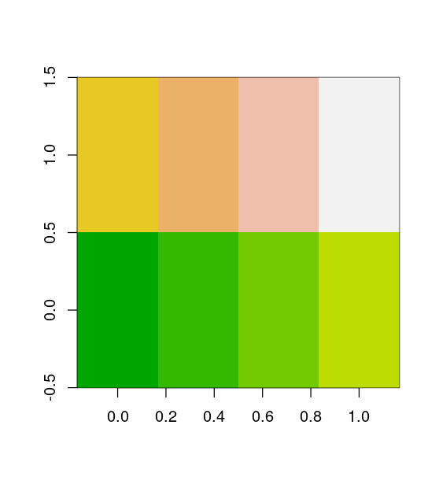
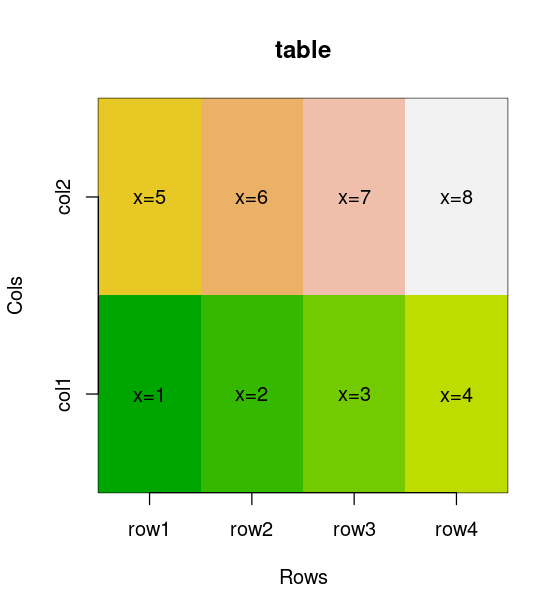

# Improve the `image` R function

## Task

Implement a function that improves the capabilities of the `image` function in R: it should write text in cells and label rows and columns in accordance with the `rownames` and `colnames` of the input matrix.

## Solution

R function ([**image_with_text.R**](image_with_text.R)):

```R
imageWithText <- function (mat, prefix='x=', xlab='Rows', ylab='Cols',
                           main='table', col=terrain.colors(100)) {
  #' Extends standard `image` function adding text to every cell.
  #' 
  #' matrix `mat` - input matrix;
  #' character `prefix` - prefix to be printed with every values in cells;
  #' character `xlab` - label of X axis, default: 'Rows';
  #' character `ylab` - label of Y axis, default: 'Cols';
  #' character `main` - main title of the figure;
  #' character `col` - colours of cells, default: `terrain.colors(100)`.
  #' Nothing is returned.

  rows <- 1:nrow(mat)
  cols <- 1:ncol(mat)
  image(rows, cols, mat, col=col, xaxt='n', yaxt='n', main=main,
        xlab=xlab, ylab=ylab,)
  axis(1, rows, labels=rownames(mat))
  axis(2, cols, labels=colnames(mat))
  for (i in rows)
    for (j in cols)
      text(i, j, paste0(prefix, mat[i,j]))
}
```

## Example of usage:

Create matrix:

```R
mat <- matrix(1:8, ncol=2)
colnames(mat1) <- paste0('col', 1:2)
rownames(mat1) <- paste0('row', 1:4)
mat1
```
---
Outpit:
```
        col1 col2
row1    1    5
row2    2    6
row3    3    7
row4    4    8
```

Plot with the standard function `image`:
```R
image(mat1, col=terrain.colors(100))
```



Plot with the function `imageWithText`:
```R
imageWithText(mat=mat1, prefix='x=')
```


